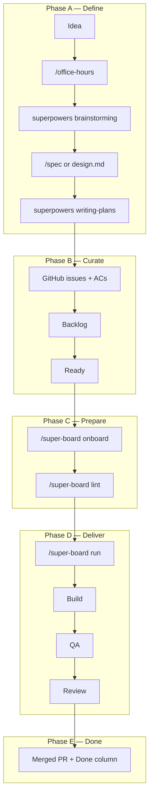

# Idea → Merged PR: Full Project Building Flow

> **New to this?** Follow the hands-on tutorial first: [GETTING-STARTED.md](../GETTING-STARTED.md) (20 steps, zero to merged PR on a new repo).

End-to-end playbook for building software with **gstack** + **superpowers** + **super-board**.

**Scope:** From raw idea to **squash-merged PR** on your integration branch. Production deploy (`/land-and-deploy`) is optional and listed at the end.

**Hosts:** Claude Code primary; gstack and superpowers also work on Cursor/Codex with separate installs.

---

## Overview

```text
PHASE A   Idea → product definition     (you + gstack + superpowers)
PHASE B   Plan → GitHub board           (you)
PHASE C   Prepare pipeline              (super-board onboard + lint)
PHASE D   Autonomous delivery           (super-board run)
PHASE E   Merged                        (Reviewer or you)
```



---

## Prerequisites (one-time)

| Item | Tool |
|------|------|
| Claude Code + dynamic workflows | `/config` |
| `gh` CLI authenticated (`project`, `repo` scopes) | `gh auth login` |
| `jq`, bash 4+, Python 3 | system |
| **super-board** installed | `./super-board/install.sh .` |
| **superpowers** plugin | `/plugin install superpowers@claude-plugins-official` |
| **gstack** | `cd gstack && ./setup` (needs Bun) |
| GitHub Project v2 | Columns: `Backlog`, `Ready`, `Building`, `QA`, `Review`, `Done`, `Blocked`, `Skipped` |

---

## Phase A — Idea to buildable definition

**Goal:** Know *what* to build and *how to verify done* before any card hits `Ready`.

### A1 — Frame the problem (gstack)

```text
/office-hours
```

- Six forcing questions: pain, user, success metric, scope
- Output: design doc / reframed product intent
- **You:** approve or adjust framing

### A2 — Strategic + technical plan (gstack)

Pick one or combine:

| Command | Role |
|---------|------|
| `/autoplan` | CEO → design → eng review in one pipeline |
| `/plan-ceo-review` | Scope, 10-star product, expand/reduce |
| `/plan-eng-review` | Architecture, data flow, failure modes |
| `/plan-design-review` | UX dimensions, anti–AI-slop |
| `/cso` | Security (OWASP/STRIDE) before big features |

### A3 — Design document (superpowers)

```text
superpowers:brainstorming
```

- Questions in chunks; design in readable sections
- Save to repo: `docs/superpowers/specs/<feature>-design.md` (convention super-board references)

### A4 — Executable spec (optional, gstack)

```text
/spec
```

- Precise spec file, quality gate, archived for team recall
- Good when intent is still fuzzy after brainstorming

### A5 — Implementation plan (superpowers)

```text
superpowers:writing-plans
```

- Bite-sized tasks: file paths, code sketches, verification per task
- **You:** sign off before coding starts

**Phase A exit criteria:** You can write GitHub issues with testable acceptance criteria without guessing.

---

## Phase B — GitHub board curation (human)

**Goal:** One card = one shippable unit of work.

### B1 — Create issues from the plan

See **[plan-to-issues-bridge.md](plan-to-issues-bridge.md)** for mapping strategies (vertical slice vs one-issue-per-task), `Depends on:` ordering, and tooling.

Each issue should look like:

```markdown
## Goal
<one sentence outcome>

## Acceptance Criteria
- [ ] <observable behavior or artifact>
- [ ] <test expectation>

## Notes
- Skills: superpowers:test-driven-development, superpowers:verification-before-completion
- Depends on: #12
```

Rules:

- **Measurable ACs** — no “snappier”, “better UX” without thresholds
- **Small scope** — one feature area per card
- **`Depends on:`** — block until dependency is merged/closed
- **Skills line** — tells Builder/QA which superpowers to load

### B2 — Project board placement

| Column | Meaning |
|--------|---------|
| **Backlog** | Planned, not ready for agents |
| **Ready** | Fully scoped — agents may pick up |
| Building / QA / Review / Done | Agent-managed during `run` |
| **Blocked** | Human required (conflict, creds, product call) |

**You drag:** Backlog → **Ready** only when the issue passes the “headless worker test” (a stranger could implement it from the text alone).

---

## Phase C — Pipeline preparation (super-board)

**Goal:** Config + ticket hygiene + environment checks.

### C1 — Onboard (once per project/slug)

```text
/super-board onboard
```

Creates `.claude/super-board/configs/<slug>.json`:

```json
{
  "variant": "full",
  "worker_backend": "workflow",
  "model_tier": "medium",
  "project": { "owner": "YOUR_ORG", "number": 12 },
  "base_branch": "staging",
  "human_approves_merge": true,
  "rebuild_cap": 2,
  "max_workers": 3,
  "notifications": { "bot_identity": "YOUR_GH_LOGIN" }
}
```

**First runs:** `human_approves_merge: true` and non-production `base_branch` are safer.

### C2 — Lint (before every major run / when board changes)

```text
/super-board lint
```

- Confirms project understanding with you
- Flags vague issues (12 criteria)
- Drafts ACs — you approve / edit / block / skip per issue
- Writes `docs/super-board/pre-flight.md` (API keys, Playwright, env)

**`run` halts** if pre-flight has unchecked items or issues lack ACs.

### C3 — Status snapshot (optional)

```text
/super-board status <slug>
```

Read-only kanban — no side effects.

---

## Phase D — Autonomous delivery loop

**Goal:** Drain `Ready` → merged PRs without you coding in the orchestrator session.

### D1 — Start the loop

```text
/super-board run <slug>
```

Optional model tier: `--low` | default | `--high`

### D2 — What the orchestrator does (every wave)

1. Rate-limit guard (`gh` GraphQL budget)
2. **Plan wave** — downstream-first: Review → QA → Ready (max 3 cards, 1 per lane)
3. **Claim** issues (assignee mutex)
4. **Launch** `super-board-wave` workflow
5. **Reconcile** — release assignees, log manifest, report one line per wave
6. Repeat until drained or halt gate

**You do not code in this session.** The orchestrator only dispatches.

### D3 — Per-card journey (happy path)

```text
Ready
  → classify (kind + complexity → model tier)
  → Building   [super-build]
  → QA         [super-qa]
  → Review     [super-review]
  → Done       (merged + issue closed)
```

#### Build lane (`super-build`)

- Worktree `.worktrees/issue-N-build/`
- Branch `issue-N-<slug>` (one branch + one draft PR per issue)
- **superpowers:** TDD, verification-before-completion (from issue `Skills:` line)
- **gstack:** `/plan-ceo-review`, `/plan-eng-review`, `/cso`, `/plan-design-review` on ambiguous implementation forks (majority vote)
- Push, open draft PR, comments on issue + PR, card → **QA**

#### QA lane (`super-qa`)

- Same branch, new worktree
- Test plan: one observable test per AC
- Evidence: `docs/super-board/runs/issue-N-qa-v1/` + screenshots (desktop/tablet/mobile)
- **Pass** → **Review**
- **Fail** → **Ready** + `loop:rebuild-N` + feedback (fix loop)

#### Review lane (`super-review`)

- Rerun tests (closes self-verification gap)
- Truth-gate sub-agents on non-trivial diffs (confidence vs threshold)
- **Approve** → squash-merge into `base_branch`, close issue, card → **Done**
- **Code issue** → bounce **Ready** (`loop:rebuild-N`)
- **Test issue** → bounce **QA**
- **Truth fail / human gate** → **Blocked**

If `human_approves_merge: true`: Reviewer marks PR ready; **you click merge** on GitHub; card moves to Done when merged.

### D4 — Fix loops (built-in)

| Event | Card goes to | Next wave |
|-------|--------------|-----------|
| QA fail | Ready | Builder rebuild (reads QA comments) |
| Review code finding | Ready | Builder rebuild |
| Review test finding | QA | Tester fix |
| Same root cause × `rebuild_cap` | Blocked | You intervene |

### D5 — Stop / resume

```text
/super-board stop    # mid-flight comments, release locks
/super-board run <slug>   # resume — board is the state
```

---

## Phase E — Merged (definition of done for this playbook)

**Done when:**

- [ ] PR is **merged** into `base_branch` (agent or you)
- [ ] GitHub issue **closed**
- [ ] Project card in **Done**
- [ ] Branch deleted (Reviewer does this on auto-merge)

**Artifacts left behind:**

- Merged commit on `base_branch`
- Issue + PR comment trail (Build → QA → Review iteration history)
- QA evidence folders on the branch history (in git log)

---

## Exception playbooks

### Merge conflict (card Blocked or PR not mergeable)

```text
1. /super-board stop
2. git checkout issue-N-<slug>
3. /ship                          # gstack: merge base, auto-fix simple conflicts
4. Resolve anything /ship stopped on
5. push + run tests               # superpowers:verification-before-completion
6. Move card → QA (if code changed) or Review (sync only)
7. /super-board run <slug>
```

### Vague issue slipped through

- Do **not** leave in Ready during `run`
- Run `/super-board lint`, fix ACs, move back to Ready

### Production / secrets / irreversible ops

- Worker **human-gates** or Reviewer moves to **Blocked**
- You execute manually; unblocks when safe

---

## Tool ownership summary

| Stage | Primary tool |
|-------|----------------|
| Idea, PRD framing | gstack `/office-hours`, `/plan-ceo-review` |
| Architecture / security plan | gstack `/plan-eng-review`, `/cso`, `/autoplan` |
| Design doc | superpowers `brainstorming` |
| Implementation plan | superpowers `writing-plans` |
| Spec file | gstack `/spec` |
| Issues + ACs | **You** (+ super-board `lint`) |
| Board orchestration | super-board `run` |
| Coding discipline | superpowers TDD, verification |
| Gray build decisions | gstack advisor votes (Builder) |
| Test vs ACs | super-board `super-qa` |
| Merge readiness | super-board `super-review` |
| Conflict rescue | gstack `/ship` (interactive) |
| Branch finish guidance | superpowers `finishing-a-development-branch` |

---

## Command cheat sheet

```text
# Phase A
/office-hours
/autoplan
/superpowers brainstorming → writing-plans

# Phase C
/super-board onboard
/super-board lint
/super-board status <slug>

# Phase D
/super-board run <slug>
/super-board stop

# Exceptions
/ship
superpowers:verification-before-completion
```

---

## Recommended first-project settings

| Setting | Value | Why |
|---------|-------|-----|
| `base_branch` | `staging` or `develop` | Not production `main` on first runs |
| `human_approves_merge` | `true` | You click merge until trust is high |
| `variant` | `full` | Build + QA + Review |
| `worker_backend` | `workflow` | In-session waves (default) |
| `rebuild_cap` | `2` | Stop infinite bounce loops |
| Ready queue | 1–3 small cards | Learn the loop before scaling |

---

## Optional — after merged (out of scope for “just merged”)

| Step | Tool |
|------|------|
| Merge + deploy + verify prod | gstack `/land-and-deploy` |
| Post-deploy monitoring | gstack `/canary` |
| Update docs | gstack `/document-release` |
| Team retro | gstack `/retro` |

---

## One-page timeline (example feature)

```text
Day 0  You:     "We need streaming chat"
       gstack:  /office-hours → reframed scope
       superpowers: brainstorming → design.md
       superpowers: writing-plans → task list

Day 1  You:     Issue #47 + ACs → Backlog → Ready
       super-board: onboard → lint (polish #47)

Day 1  super-board: run myapp
       #47: classify → build → QA fail → Ready (rebuild-1)
       #47: rebuild → QA pass → Review → merged → Done

Day 2+ Next card in Ready; wave loop continues until board drained
```

---

*Playbook version: 2026-06-19 — SuperSaiyan study sandbox*
